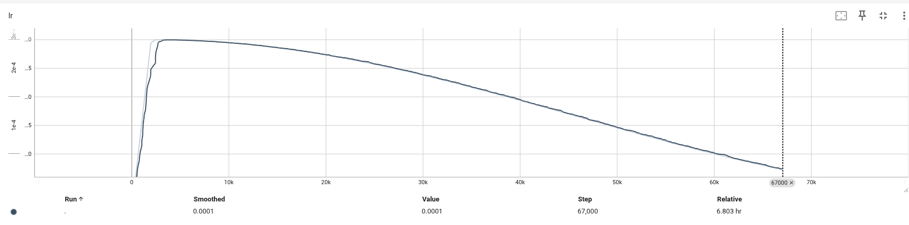

# Large Language Model From Scratch
This repository implement a Llamma2 like Large Language Model (LLM) from scratch using only basic functionality of Python and PyTorch. This project serves as an educational implementation to understand the core components of modern transformer-based language models.

## Implemented Components
+ **BPE Tokenizer** - Byte Pair Encoding tokenizer for text preprocessing - see [`tokenizer.py`](llm/tokenizer.py)
+ **Llama2-like Transformer Model** - Transformer architecture - see [`layers.py`](llm/layers.py)
+ **Flash Attention 2** - Flash Attention via Triton - see [`flash_attention.py`](llm/flash_attention.py)
+ **Data Parallel Distributed Training** - Partition data across processors, use all-reduce to synchronize gradients - see[`data_parallel_wrap.py`](llm/data_parallel_wrap.py)
+ **AdamW Optimizer** - Weight decay regularized Adam optimizer - see [`adamw.py`](llm/optimizer/adamw.py)
+ **Muon Optimizer** - Muon is a brandly new optimizer for hidden layers of neuron networks - see [`muon.py`](llm/optimizer/muon.py)
+ **Zero-1** - Distributed Optimizer which partition optimizer's inner state across nodes - see [`zero.py`](llm/optimizer/zero.py)
+ **Cosine Annealed Learning Rate Scheduler** - Learning rate scheduling - see [`lr_scheduler.py`](llm/lr_scheduler.py)
+ **Training Framework** - Complete training loop with logging and checkpoint management - see [`trainer.py`](llm/trainer.py)
+ **Data Utilities** - DataLoader - see [`utility.py`](llm/utility.py)

## Prerequisites
- Python 3.12
- PyTorch
- All the code is tested in a machine with Ubuntu Operating System and GTX 1080 GPU

## Quick Start

### Installation and Testing
1. **Clone this repository** 
```sh
git clone https://github.com/tfzzzh/llm_from_scratch.git
cd llm_from_scratch
```
2. **Install uv package manager**
```sh
pip install uv
```
3. **Run tests to verify installation**
```sh
uv run pytest
```

## Dataset Preparation
### Download TinyStories Dataset
``` sh
mkdir -p data
cd data

wget https://huggingface.co/datasets/roneneldan/TinyStories/resolve/main/TinyStoriesV2-GPT4-train.txt
wget https://huggingface.co/datasets/roneneldan/TinyStories/resolve/main/TinyStoriesV2-GPT4-valid.txt

cd ..
```
### Train Tokenizer and Preprocess Data
```sh
uv run python scripts/prepare_dataset.py
```
**Note:** Depending on your hardware, this script may take approximately 30 minutes to complete. Upon completion, you'll have:
- A trained BPE tokenizer checkpoint
- Tokenized training and validation datasets
## Training the Model
### Start Training
```shell
# train LLM via Adam
uv run python scripts/train_llm.py --config_file ./configs/config.yaml

# train LLM via Muon
# uv run python scripts/train_llm.py --config_file ./configs/muon_config.yaml

# train LLM via Data Parallel
# uv run python scripts/data_parallel_train.py

# train LLM via Zero-1 Parallel
# uv run python scripts/zero_train.py
```
## Monitor Training Process
Launch TensorBoard to visualize training metrics in real-time:
```sh
uv run tensorboard --logdir ./outputs/tensorboard/
```
Then navigate to http://localhost:6006 in your browser to view:
- loss curves
- Learning rate schedules
- gradient norms during the training


## Training Results
### Training Results of AdamW

*Training loss decreases steadily over epochs, showing effective learning*

*Cosine annealing schedule provides smooth learning rate decay*
### Comparison Between AdamW with Muon

- Muon converges much more fast. It attains a loss below 3.0 in less than 172 steps
- Adam finds a better weight than Muon after 4000 steps

## References and Acknowledge
- [Stanford CS336: Language Modeling from Scratch](https://stanford-cs336.github.io/spring2025/)
- [Attention Is All You Need](https://arxiv.org/abs/1706.03762) - Original Transformer paper
- [Llama 2: Open Foundation and Fine-Tuned Chat Models](https://arxiv.org/abs/2307.09288)
- [TinyStories Dataset](https://huggingface.co/datasets/roneneldan/TinyStories)
- [Flash Attention2](https://arxiv.org/abs/2307.08691)
- [ZeRO: Memory Optimizations Toward Training Trillion Parameter Models](https://arxiv.org/abs/1910.02054)
- [Muon: An optimizer for hidden layers in neural networks](https://kellerjordan.github.io/posts/muon/)